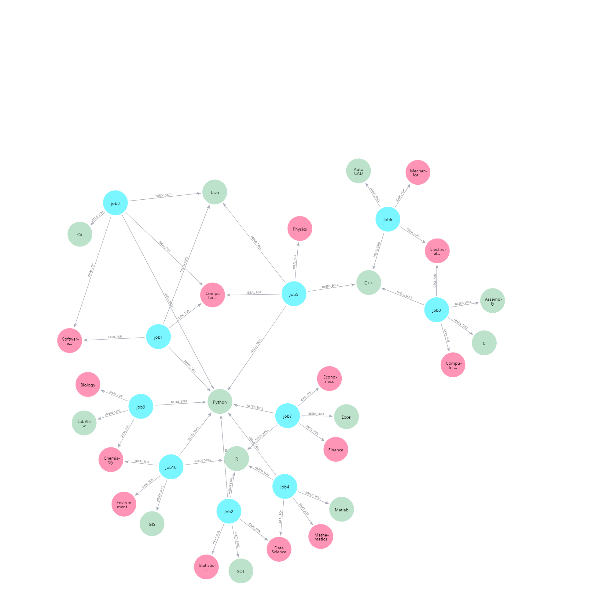

  
# Career Navigator

## Briefly
Career Navigator is an innovative job recommendation service based on LLM and Knowledge Graph, which aims to solve the challenges encountered by our pool of students in searching for jobs on the CSM platform, and to improve the efficiency of students in finding suitable positions. By utilizing advanced knowledge graph technology and graph algorithms, the system can deeply analyze the content of a student's resume, intelligently match it with the available job data, and recommend the job that best matches his/her skills and experience.

## Knowledge Graph Visualization

## System Architecture

